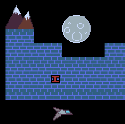
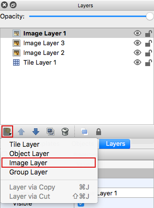
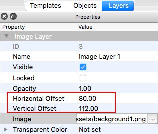

# haxeflixel-tiled-image-layers-fix-demo

This is a demo for Fixing Tiled Image Layers Offsets in Tiled.

### Use Case

Image layer offsets in Tiled used to be defined by properties `x` and `y`. As of Tiled version 0.15 image layer offsets are now defined by properties `offsetx` and `offsety`. These properties are already available in `TiledLayer`.

  
*TMX source file. Offsets are defined by properties `offsetx` and `offsety`*

  
*Multiple Image Layers with various offset*

### In Tiled Editor

To edit image layer offsets in Tiled:

1. Add an Image Layer to a map from **Layers >> New Layer >> Image Layer**  

2. Select a source image for the Layer from **Properties**  

2. Change the `Horizontal Offset` and/or `Vertical Offset` in **Properties**  
